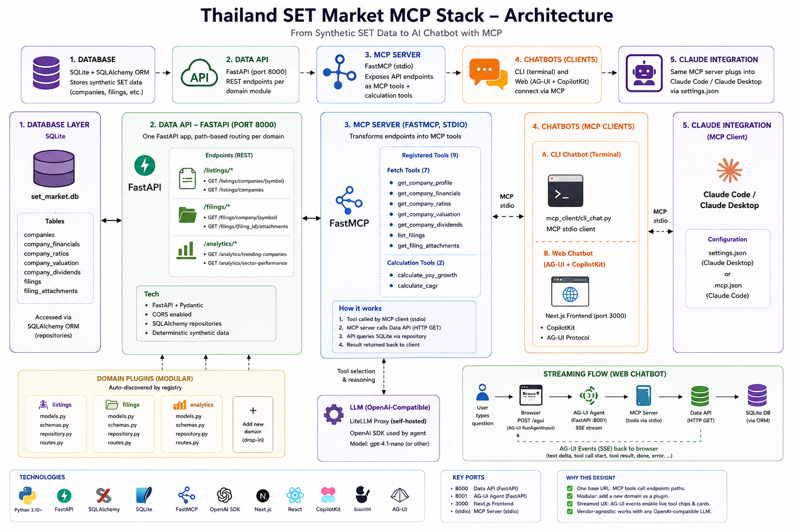

# Thailand SET Market — MCP + AG-UI PoC

End-to-end proof of concept: synthetic **Stock Exchange of Thailand (SET)** market
data, served by a FastAPI **Data API**, exposed to LLMs through an **MCP server**,
and consumed by two chatbots — a terminal client and a streaming **AG-UI** web app
(custom Claude-style UI with live tool-call chips + generative cards). The same MCP
server plugs straight into **Claude Code** and **Claude Desktop**.

> ⚠️ All financial figures are **synthetic** (deterministically generated). Ticker
> symbols and sectors are real SET names for realism only — this is not market data.



---

## Architecture

```
                       ┌──────────────────────────────┐
                       │  SQLite (set_market.db)       │
                       │  companies · filings (ORM)    │
                       └───────────────┬───────────────┘
                                       │ SQLAlchemy
                       ┌───────────────▼───────────────┐
                       │  Data API — FastAPI :8000      │
                       │  /listings  ·  /filings        │
                       └───────────────┬───────────────┘
                                       │ HTTP (httpx)
                       ┌───────────────▼───────────────┐
                       │  MCP Server (FastMCP, stdio)   │
                       │  fetch tools + calc tools      │
                       └───────┬───────────────┬────────┘
                       stdio   │               │  stdio
        ┌──────────────────────▼──┐   ┌────────▼──────────────────────┐
        │  CLI chatbot (MCP client)│   │  AG-UI agent (MCP client) :8001│
        │  mcp_client.cli_chat     │   │  Claude + AG-UI event stream   │
        └──────────────────────────┘   └────────┬──────────────────────┘
                                                 │ AG-UI over HTTP/SSE (browser fetch)
                                       ┌─────────▼──────────────────────┐
                                       │ Next.js custom chat   :3000     │
                                       │ streamed text + tool chips/cards│
                                       └─────────────────────────────────┘
                       ┌────────────────────────────────────────────────┐
                       │ Claude Code / Claude Desktop  ── .mcp.json ─────►│ MCP Server
                       └────────────────────────────────────────────────┘
```

**Key design choices**

- The MCP server reaches data **only over the HTTP API** — the API boundary is real.
- All maths lives in `core/calculations.py` (pure functions), reused everywhere.
- Both chatbots are **MCP clients** to the one MCP server (`mcp_client/session.py`).
- The AG-UI agent *is* the MCP client, wrapped as an AG-UI event stream. The browser
  consumes that stream directly and renders streaming text **and** tool calls as
  live chips + cards (no chat framework — see `frontend/lib/agui.ts`).

---

## Repository layout

```
SET-MCP-SERVER/
├── backend/
│   ├── core/            config · database · registry · calculations · seed (framework)
│   ├── modules/         PLUGGABLE DOMAINS — each is self-contained
│   │   ├── README.md        how to add a module
│   │   ├── listings/        companies table + /listings + 3 tools + seed
│   │   ├── filings/         filings table + /filings + 2 tools + seed
│   │   └── analytics/       tool-only: 4 calculation tools (no table)
│   ├── data_api/        FastAPI app — auto-mounts every module router
│   ├── mcp_server/      FastMCP server — auto-registers every module's tools
│   ├── mcp_client/      reusable MCP session + terminal chatbot
│   ├── agui_agent/      AG-UI streaming agent (FastAPI :8001)
│   ├── requirements.txt
│   └── .env.example
│   └── tests/           pytest for the pure calculations
├── frontend/            Next.js custom AG-UI chat (streaming + generative cards)
├── run_all.bat          one launcher: Data API + agent + frontend
├── .mcp.json            Claude Code MCP config
├── claude_desktop_config.example.json
├── EXPLANATION.md       full per-file walkthrough + architecture deep dive
└── REVIEW.md            code review & gap analysis
```

### Modular architecture (add features without touching shared code)

A **module** under `backend/modules/<name>/` declares one `MODULE = ModuleSpec(...)`
and is auto-discovered (`core/registry.py`). It can contribute any of:
a **database table** (ORM), a **REST router**, **MCP tools**, and a **seed** hook.
The Data API, the MCP server and the seeder all iterate the registry — so a new
teammate drops a package in `modules/` and it appears everywhere, no edits to
`data_api`, `mcp_server`, or `core`. Full guide: [`backend/modules/README.md`](backend/modules/README.md).

---

## Prerequisites

- Python 3.11+ (tested on 3.14)
- Node.js 18+ (for the web frontend only)
- An **OpenAI-compatible LLM gateway** — `LLM_API_KEY` + `LLM_BASE_URL` (e.g. a
  LiteLLM proxy). Needed for the two chatbots only; the Data API and the
  MCP-in-Claude integration need **no** LLM key.

> The chatbots speak the **OpenAI Chat Completions** API to `LLM_BASE_URL/v1`.
> Env vars use an `LLM_` prefix on purpose, to avoid colliding with any
> `ANTHROPIC_*` variables already set in your OS environment.

---

## 1. One-time setup

**Backend** (from repo root) — uses `uv` (or swap for `python -m venv` + `pip`):

```powershell
cd backend
uv venv .venv
uv pip install -r requirements.txt
copy .env.example .env          # then edit: LLM_API_KEY, LLM_BASE_URL, LLM_MODEL
python -m core.seed --reset     # build + seed SQLite
cd ..
```

**Frontend** (one-time):

```powershell
cd frontend
copy .env.local.example .env.local
npm install
cd ..
```

## 2. Run the whole project

```powershell
run_all.bat
```
Opens three windows — **Data API :8000**, **AG-UI agent :8001**, **frontend :3000** —
then browse to **http://localhost:3000**. Ask *"Compare KBANK, SCB and BBL"* and watch
the tool chips spin, cards drop in, and the answer stream.

### Run pieces manually (equivalent commands)

```powershell
# Backend — Data API (Swagger at http://127.0.0.1:8000/docs)
cd backend; .venv\Scripts\python.exe -m uvicorn data_api.main:app --port 8000

# Backend — AG-UI agent (needs LLM_API_KEY + LLM_BASE_URL in backend\.env)
cd backend; .venv\Scripts\python.exe -m uvicorn agui_agent.main:app --port 8001

# Frontend
cd frontend; npm run dev          # -> http://localhost:3000

# Terminal chatbot (alternative to the web UI; starts MCP server itself via stdio)
cd backend; .venv\Scripts\python.exe -m mcp_client.cli_chat

# Tests
cd backend; .venv\Scripts\python.exe -m pytest tests/
```

---

## 3. Integrate the MCP server into Claude Code / Claude Desktop

**The Data API must be running** (`run_all.bat` starts it, or run the uvicorn
command above) — the MCP server fetches from it.

### Claude Code
`.mcp.json` is already at the repo root. From this folder run `claude`, approve the
`set-market` server, then ask Claude about SET companies. Adjust the `cwd`/`command`
paths if your layout differs (use the venv python for reliability).

### Claude Desktop
Merge `claude_desktop_config.example.json` into
`%APPDATA%\Claude\claude_desktop_config.json` (point `command` at
`backend\.venv\Scripts\python.exe`) and restart Claude Desktop.

---

## MCP tools

| Tool | Type | Description |
|------|------|-------------|
| `get_company` | fetch | Listing details for one ticker |
| `search_companies` | fetch | Filter by sector / board (SET\|mai) |
| `list_sectors` | fetch | Sectors with company counts |
| `get_filings` | fetch | Filing history (Quarterly\|Annual) — renders as a revenue/profit **trend chart** |
| `get_latest_filing` | fetch | Most recent filing |
| `calc_financial_ratios` | calc | Margin, ROE, ROA, D/E, turnover, valuation |
| `calc_revenue_growth` | calc | QoQ / YoY revenue & profit growth |
| `compare_companies` | calc | Side-by-side valuation + highlights |
| `sector_ranking` | calc | Rank a sector by a chosen metric |

---

## Data model

**companies**: `symbol` (PK), name, sector, industry, market, listing_date,
par_value, shares_outstanding, last_price, market_cap, pe_ratio, pb_ratio,
dividend_yield, is_active.

**filings**: `filing_id` (PK), `symbol` (FK), filing_type, fiscal_period,
filing_date, revenue, net_profit, total_assets, total_liabilities, total_equity,
operating_cash_flow, eps. *(8 quarters 2023Q1–2024Q4 + an FY2024 annual per company.)*

---

## Troubleshooting

- **Agent won't start** — `LLM_API_KEY` / `LLM_BASE_URL` missing in `backend\.env`.
- **401 from the LLM** — wrong key, or `LLM_BASE_URL` overridden by an OS env var.
- **Empty replies** — `MAX_TOKENS` too low for a reasoning model; raise it (≥2048).
- **Tool results say "Not found" / connection refused** — the Data API (8000) isn't running.
- **Web chat says "Can't reach the agent"** — the AG-UI agent (8001) isn't running.
- **MCP server in Claude shows no data** — start the Data API first.
- **Reseed** — `python -m core.seed --reset`.
- **Run tests** — `python -m pytest tests/` (from `backend/`).
